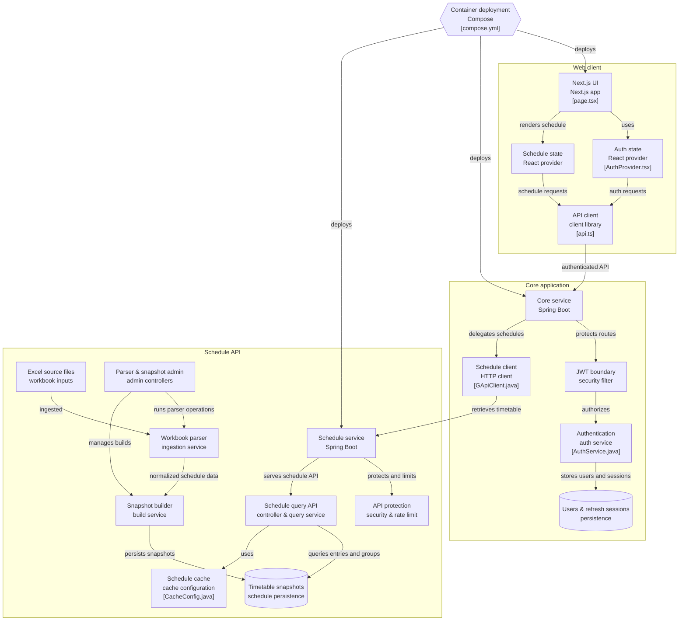

# Gradinator

Gradinator — информационная система для работы с расписанием Ярославского государственного колледжа градостроительства

Система предоставляет доступ к расписанию учебных групп,
обрабатывает исходные файлы расписания и хранит историю опубликованных состояний расписания.
Архитектура разделена на отдельные приложения, отвечающие за пользовательский интерфейс,
бизнес-логику и получение данных расписания

## Возможности

На текущем этапе Gradinator включает:

- просмотр расписания учебной группы
- получение актуальных данных расписания
- работу с данными из сырых исходников Excel-файлов
- нормализацию исходного расписания во внутреннюю модель
- построение и хранение снапшотов расписания
- хранение истории снапшотов
- управление пользователями
- аутентификацию и авторизацию

## Архитектура

Gradinator состоит из трёх основных модулей:

- **G-Web** — web-клиент и пользовательский интерфейс
- **G-Core** — основное backend-приложение, отвечающее за пользователей, аутентификацию и бизнес-логику
- **G-API** — отдельный api-сервис расписания, отвечающий за загрузку, обработку, хранение и предоставление данных расписания

Общая схема взаимодействия компонентов:



### Поток данных расписания
выглядит следующим образом:

```text
Исходный Excel-файл
        ↓
   G-API Parser
        ↓
Нормализованные данные
        ↓
 Snapshot Builder
        ↓
Снимок расписания
        ↓
    PostgreSQL
        ↓
 Schedule Query API
        ↓
      G-Core
        ↓
      G-Web
        ↓
Пользователь
```

Такое разделение позволяет отделить формат исходных данных от модели, 
используемой остальной системой. Например, изменения в структуре исходного Excel-файла
не должны требовать изменений в G-Core или G-Web

### Взаимодействие приложений

G-Web не обращается к G-API напрямую. Запросы клиента проходят через буфер в виде G-Core:

```text
G-Web → G-Core → G-API
```

G-Core выступает границей между клиентом и внутренними сервисами системы. 
Он отвечает за пользовательский контекст, безопасность и бизнес-логику, 
а получение данных расписания делегирует G-API

G-API же, в свою очередь, не отвечает за пользователей приложения.
Его задача — предоставить надёжный источник данных расписания

## Компоненты

### G-Web

Веб-клиент Gradinator, построенный на Next.js.

Отвечает за:

- пользовательский интерфейс;
- состояние аутентификации;
- состояние расписания;
- взаимодействие с backend API;
- отображение данных пользователю.

Подробнее: [g-web/README.md](./g-web/README.md)

### G-Core

Основное backend-приложение на Spring Boot.

Отвечает за:

- пользователей;
- аутентификацию;
- авторизацию;
- JWT;
- refresh-сессии;
- бизнес-логику;
- клиент через G-API.

Подробнее: [g-core/README.md](./g-core/README.md)

### G-API

Backend-сервис расписания на Spring Boot.

Отвечает за:

- импорт исходных из сырых файлов;
- разбор и нормализацию расписания;
- построение снапшотов дней;
- хранение данных расписания;
- предоставление расписания через API;
- кэширование запросов;
- административное управление обработкой данных.

Подробнее: [g-api/README.md](./g-api/README.md)

## Технологии

### Backend

- Java
- Spring Boot
- Spring Security
- Spring Data JPA
- Apache POI
- Hibernate
- PostgreSQL
- Maven

### Frontend

- Next.js
- React
- TypeScript

### Инфраструктура

- Docker
- Docker Compose

## Запуск и Конфигурация

Для локальной разработки компоненты могут запускаться независимо друг от друга.

Для запуска production-окружения используется Docker Compose:

```bash
docker compose up -d
```

Конфигурация контейнеров, сетей, базы данных и переменных окружения определяется в `compose.yml` и файле окружения.
Подробные инструкции по отдельным приложениям находятся в их README.

Внутреннее взаимодействие сервисов происходит через Docker network.

# Но прежде нужно создать .env файл, заполнить инфу и указать время JWT в миллисекундах:
Для запуска production-окружения необходимо создать `.env` на основе
`.env.example`:

```bash
cp .env.example .env
```
и 
```
JWT_ACCESS_EXPIRATION=900000 //= 15 минут
JWT_REFRESH_EXPIRATION=2592000000 //= 30 дней
```
## Документация

- [G-API](./g-api/README.md)
- [G-Core](./g-core/README.md)
- [G-Web](./g-web/README.md)

Архитектурная схема проекта находится в `architecture.mmd`.

## Статус проекта

Gradinator находится в активной разработке. Запущена демка

Архитектура и отдельные API могут изменяться по мере развития проекта.

## License

Gradinator is distributed under a custom source-available license.

The source code may be viewed, studied, modified, and distributed under the terms of the license.

Running, deploying, hosting, or operating the Project requires explicit permission from the copyright holder.

See [`LICENSE.md`](./LICENSE.md) for the full license text.

